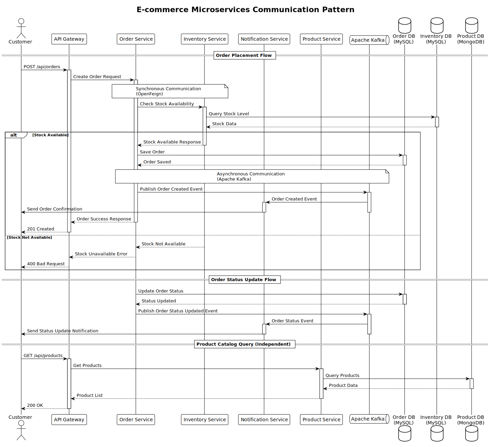

# E-commerce Microservices Platform

## Overview

This project implements a scalable e-commerce platform using microservices architecture built with Spring Boot 3 and Java 21. The system comprises four core microservices that handle different aspects of the e-commerce operations, utilizing both synchronous and asynchronous communication patterns.

## Architecture

### Core Microservices

1. **Product Service**

   - Manages product catalog
   - Creates and maintains product information
   - Database: MongoDB
   - Key Operations: CRUD operations for products

2. **Order Service**

   - Handles order processing
   - Communicates with Inventory and Notification services
   - Database: MySQL
   - Key Operations: Order creation, status management

3. **Inventory Service**

   - Manages product stock levels
   - Real-time inventory tracking
   - Database: MySQL
   - Key Operations: Stock verification, inventory updates

4. **Notification Service**
   - Handles customer communications
   - Event-driven architecture using Kafka
   - Key Operations: Order confirmations, status updates

### Communication Patterns



- **Synchronous Communication**:

  - Order Service ↔ Inventory Service (OpenFeign)
  - Real-time stock verification during order placement

- **Asynchronous Communication**:
  - Order Service → Notification Service (Apache Kafka)
  - Event-based notifications for order status updates

### Technical Stack

#### Core Technologies

- Java 21
- Spring Boot 3
- Docker & Kubernetes
- Apache Kafka
- OpenFeign
- Resilience4j

#### Databases

- MongoDB (Product Service)
- MySQL (Order & Inventory Services)

#### Security & Documentation

- Keycloak (OpenID Connect)
- OpenAPI 3.0 (API Documentation)
- WireMock (Testing)

### Infrastructure Components

#### Service Discovery & Configuration

- Eureka Server for service registry
- Spring Cloud Gateway for API Gateway
- Resilience4j for circuit breaking

#### Monitoring & Observability

- Grafana
- Prometheus
- OpenTelemetry
- Grafana Tempo
- Grafana Loki

## Getting Started

### Prerequisites

- JDK 21
- Docker
- Kubernetes cluster
- MongoDB
- MySQL
- Kafka

### Installation Steps

1. Clone the repository

```bash
git clone https://github.com/your-repo/ecommerce-microservices.git
```

2. Build services

```bash
./mvnw clean package
```

3. Deploy using Docker Compose

```bash
docker-compose up -d
```

4. Deploy to Kubernetes

```bash
kubectl apply -f k8s/
```

### API Documentation

- Access OpenAPI documentation: `http://localhost:8080/swagger-ui.html`
- Individual service documentation available at: `/v3/api-docs`

## Security

- API Gateway authentication using Keycloak
- Service-to-service communication secured with OAuth2
- HTTPS enforcement
- Rate limiting implemented at Gateway level

## Testing

- Unit tests using JUnit 5
- Integration tests with WireMock
- E2E testing with Testcontainers

## Monitoring

- Metrics collection using Prometheus
- Grafana dashboards for visualization
- Distributed tracing with OpenTelemetry
- Log aggregation with Grafana Loki

## Contributing

[Include contribution guidelines]

## License

[Include license information]
